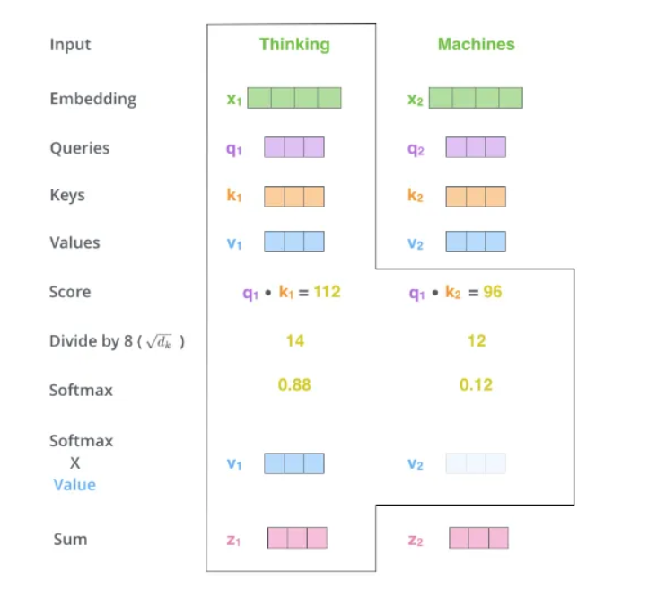
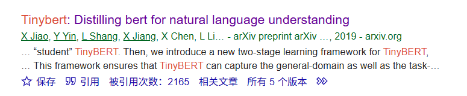
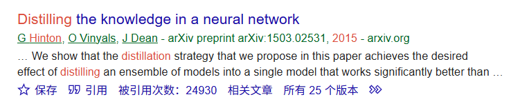

# 项目周报

    日期：2025-05-11

    项目实践题目：文本向量化的高级技术

## 实践内容
### transformer的解码器，编码器
- 它们的核心思想是将输入数据转换为一种中间表示（编码），再基于这种表示生成目标输出（解码）。

- 编码器的作用是将输入数据转化为一个固定长度的上下文向量，解码器通常以自回归的方式工作，即每一步生成的输出会成为下一步的输入。例如在机器翻译中，解码器首先生成第一个目标语言的单词，然后基于已生成的单词和上下文向量预测下一个单词，直到生成完整的句子。

- 其中，自注意力机制：将一个词向量乘上W、Q、K三个矩阵来得到三个带有不同特征而又代表同一个词的向量，不同的词的三个向量通过相乘相加，归一化，以得到一个包含有上下文信息的词向量。

- 计算过程：




- 多头自注意力机制做的改进是：一个词向量会乘以多组W、Q、K矩阵以得到多组包含三个带有不同特征的向量，最后得到多个包含上下文信息的词向量，再结合为一个词向量。这样做的是为了让得到的词向量能有不同的角度，以更好的反映词的联系.同时，单头注意力在长序列中，单一注意力可能难以兼顾远近位置的关联，导致关键信息丢失，进而无法良好反映上下文，而多个头能照顾不同的信息，如不同头可分别关注不同距离范围的依赖。短距离头：捕捉短语内部的修饰关系；中距离头：分析句子间的逻辑连接；长距离头：跟踪段落或篇章级别的主题一致性。

### 支线

#### 1.补上了LLM的python代码方式体验支线任务。

#### 2.COLBERT中引用的论文或知识点:

- 检索模型：KNRM、Duet、ConvKNRM、SNRM

- BERT优化：TinyBERT，Q8BERT

- 高效的基于NLU的模型:doc2query、DeepCT、docTTTTTquery

- 我先感兴趣的是tinyBERT：[Xiaoqi Jiao, Yichun Yin, Lifeng Shang, Xin Jiang, Xiao Chen, Linlin Li, Fang Wang,and Qun Liu. 2019. Tinybert: Distilling bert for natural language understanding.arXiv preprint arXiv:1909.10351 (2019).] 通过知识蒸馏压缩BERT模型，降低计算开销。

 

- 被引用了2000次，看起来很厉害。

- 在一番初读后，它的通篇蒸馏那蒸馏去的让人有点云里雾里，还好虽然这篇文章没有relate，但是有Preliminaries，一些预备知识，提到了知识蒸馏的论文。

- 于是又先去看了什么叫知识蒸馏,这个的厉害程度是十个TINYbert,引用25k次。

 


 - 知识蒸馏的核心思想来说，就是将复杂模型（称为教师模型）的知识转移到更小、更高效的模型（称为学生模型）中，而TINYbert的意思就是它搞了一个专门的Transformer蒸馏，所有的蒸馏都为Transformer服务，学生和教师模型都是Transformer层构建。但还没有深入了解。

 - 那么再看看别的BERT优化：Q8BERT，它的影响力没有TinyBERT那么大,引用了600次，它的核心思想是在BERT的基础上应用了量化技术，将权重和激活值从32位浮点数量化为8位整数，从而减少模型的内存占用和计算开销。也就是优化问题中的压缩成本方向。

#### 要做的事

- 目前比较有竞争力的检索模型有：COLBERT、SPLADE、DPR/ANCE、E5、FAISS/HNSW，仅深入了解了COLBERT，可以接触别的模型

- 可以尝试初步认识什么叫知识蒸馏，它的影响力很大，看起来能用在很多的地方，不然怎么会被引用25k次。

- 读TinyBERT，它的优化效果在文中提到,体积缩小7.5倍，速度提升9.4倍，看起来优化效果很好，再了解一下。


  


```python

```
