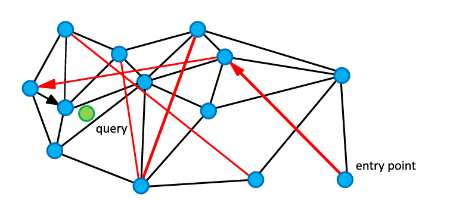
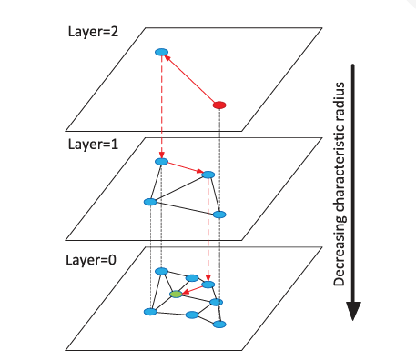
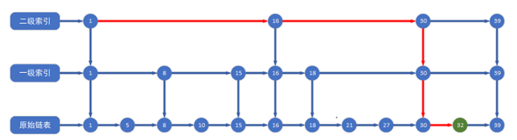

# 项目周报

    日期：2025-05-25

    项目实践题目：文本向量化的高级技术

## 实践内容
### SNW
- SNW构建过程采用增量插入策略，新元素通过贪心算法找到当前图中的近似最近邻，并建立双向连接。


- 也就是：通过贪心算法，找到当前图中离新点最近的f个节点，插入的新节点与这f个邻居建立双向边。


- 因此，越早插入的点越会连接更多的点，随着数据插入，节点逐渐增多，早期插入的点会逐渐成为“枢纽”，能够在搜寻时帮助别的点“跨越”更多的节点，以此实现长程搜索。而短程搜索则依赖贪心算法。

- 那么为何在ANN问题中要用到长程链接的搜索呢？ 因为仅依赖短程链接搜索局部邻居时，贪心搜索容易停留在某个局部区域的最近点，而忽略全局更近的邻居。

- 长程链接允许算法“跳跃”到其他区域，绕过局部最小值。例如，若当前节点的邻居都离查询点较远，长程链接可快速跳转到另一密集区域，继续搜索更优解。


- 来源：《Approximate nearest neighbor algorithm based on navigable small world graphs》


- 搜索过程为：

- 步骤1：从 Entry Point（蓝色）出发，计算其邻居(有设定数量），其中黑色为短程链接，红色为长程链接。

- 步骤2：如果节点的短程邻居均远离目标点（Query 绿色），但其红色长程链接指向的邻居离目标点更近，那么就可以“跳跃”到目标点附近。

- 步骤3：短程链接精确定位,“跳跃”到目标点附近后，再通过短程邻居（黑色链接）选择离目标点更近的节点。

- 总结：确定连接关系->通过长距离连接迅速接近目标->最后近距离微调。

- 同时，每次搜索会在多个蓝色点同时出发，以增加搜索精度

### HSNW 

- SNW有一个问题：为了节省搜索成本，每个点的“邻居列表”是有设定值的,当插入的点超过了上限，那么最远的那个邻居就会被取缔，留下6个更近的邻居，所以当数据量越来越大，留下的长程链接会越来越少。从而丢失NSW中灵魂的“高速公路”。

- 而HSNW的最大优化点就在于显式分层:


- 《Efficient_and_Robust_Approximate_Nearest_Neighbor_Search_Using_Hierarchical_Navigable_Small_World_Graphs》 

-  分层依赖于随机层级分配，这个随机分配依赖于函数$l= ⌊−ln(unif(0,1))*m_L⌋ $

-  $unif(0,1)$ 表示从均匀分布中随机采样一个 [0,1) 区间的值。 $m_l$是归一化因子（论文中建议最佳值为$1/ln(M)$，M 为每层连接数），同时外围符号表示下取整。

-  这样会使高层级的点分配的概率随层数增加而指数级降低，从而构建分层的小世界图结构。

  
- 来源：https://juejin.cn/post/6850418107438071821 HSNW

- 形成类似于跳表的结构，高层次的点依旧充当“高速公路”的作用来迅速接近目标点，低层次的点依旧用于精确接近，只是不同的是这里不同层次的点数量有明确规定，且更稳定,不会出现“高速公路”被取缔的情况。

### 模型压缩
- 简单了解蒸馏和其他的模型压缩方法
- 知识蒸馏，属于迁移学习范畴，通过将复杂教师模型（如ResNet、BERT）迁移到轻量级学生模型中，实现小模型对大模型性能的逼近。
- 轻量化模型架构，通过设计高效网络结构直接减少参数量和计算量，从源头实现模型轻量化。
- 剪枝，通过删除冗余权重或神经元压缩模型规模。
- 量化，将浮点计算转换为定点计算，降低计算和存储开销。


### 要做的事

- 推荐的Bishop内容太多了，下周要期中考概率论前五章，所以本周先不开这个内容，留到端午再弄。
- 了解其他主流大规模检索方法


```python

```
