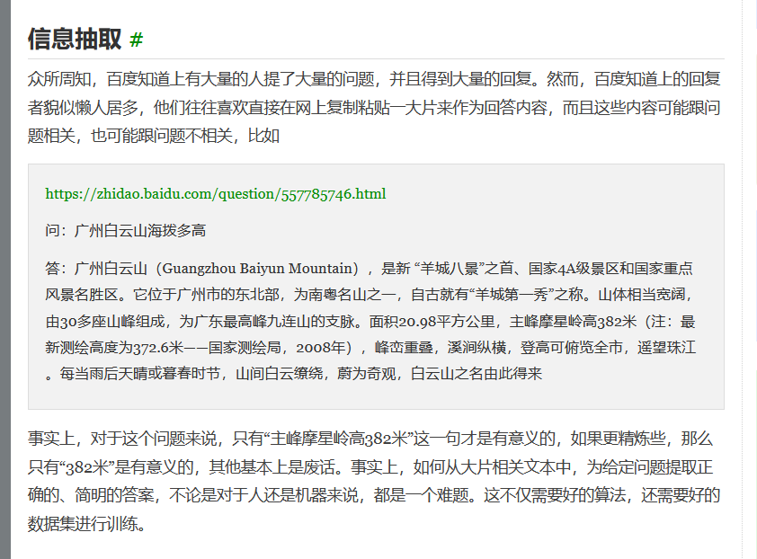

# 项目周报

-   日期：2025-06-08

-  项目实践题目：文本向量化的高级技术

## 实践内容
    
 -   邻近期末，各个科目都开始做大作业了，这个项目也应该进入验收成果阶段，再继续无休止的看各种ANN/KNN方法显然不是个办法，但是具体做什么东西确实让人为难。
    
 -   回头看自己周报学了什么，又翻了项目文档给的建议。
 -   发现在这个项目的学习过程中确实收获颇丰，尤其是学会了熟练的寻找新领域的相关知识。

 -   但是要做什么东西呢，思考良久，pass很多。

-  我想到上次HSNW的多层索引结构中的最高层是随机生成的（通过概率分配层数），也许我可以在这进行一些优化，寻找密集的向量点中间那个数为最初索引，或者什么别的方案，来获得更好的最初索引，这样有没有可能取得更好的效果呢？

 HNSW结构示意图
    
 -   依稀记得算法课分治和dp那段课程时也有过类似的问题探讨，果然在第五课第K小问题中寻到，那是“寻找中点的中点”,看起来有所共通。但又缺点意思。

 -   先前在推荐的科学空间里看文章，都很有意思。在资源共享篇里有一篇信息提取，结合它的思路，我想到能不能用在海量的向量中提取与目标有关联，或是说去除无用信息后再做近似搜索。



 -   于是分开不同的方向找:
    
 -   针对海量向量数据集的重点抽取（从数据集中选择最具代表性或信息量最大的子集），常用的方法包括核心集构建、主动学习、聚类。
    
 -   针对特定方向抽取，有特征子集选择，或是降维时通过将数据投影到低维空间，保留主要的特征方向，从而实现对特定方向的特征抽取。

 -   针对海量向量的无用信息去除则可以进行噪声过滤或是特征消除。

-    三个方向又小小的大致了解过后，发现聚类问题与上文提到的“寻找更好的索引”思路相似。
    
 -   其中k-means能很好地帮助聚类。这两个东西结合起来好像很有前景的感觉,于是我的方向终于大致确定：如何将HSNW的多层索引结构与对海量数据集的聚类结合起来，以在搜索过程中获得更好性能。
    
 -   听起来好像又是一个针对维度灾难的降维方式。但具体实现起来的效果还待验证。寻找相关论文，有几篇，但是确实没有特别对胃口，特别能提两嘴的，也许是我的想法还不太成熟，或者这个点不太行，有技术的看不上，又或者是我搜索知识的技能还不到家。
    但无论如何，都值得尝试一番。无论具体做成什么样，我都会有所进步。


 -   支线：下载了BERT的代码和训练数据集。

 -   本周总结：最多想法的一次周报，以前都是往里吃就行了，这次还得边吃边吐，要想一个合适的方向，既不会大到难以实现，又不会说简单得敷衍，还能结合自己学到的知识。那么下周就可以开始着手这个方向的具体实现。


```python

```
