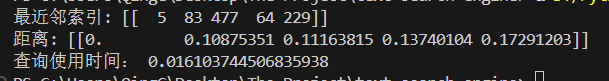

# 项目周报

-   日期：2025-06-15

-  项目实践题目：文本向量化的高级技术

## 实践内容

#### 实现一次原始的HNSW测试
- 这次基础测试，我在Kaggle中下载数据集，用pandas处理数据，并引入hnsw库进行一次测试。

  
#### 设计一个极其简单混合聚类与HNSW思想的搜索结构
##### 聚类层
- 将数据分为K个聚类，通过K个中心点划分
- 使用Kmeans++初始化中心点，然后将数据点分配给最近的中心点
  
##### HNSW层
- 每个聚类内部仍实现HNSW的多层图结构
- 同时仍使用原始HNSW算法计算。
#### 基本只对最上面的划分方式进行了聚类

##### 此结构的改进方向：
- K的数量应该根据数据集的大小进行动态定义
- 如果某个点恰好在两个聚类的边缘交界处，那么它的近似点计算该怎么办 
- 能不能只使用聚类思想直接选择HNSW的最顶层入口，不需要再进行数据点分配操作，也就是一开始提到的优化入口策略。
- 能不能进行多次聚类
- 会不会有一些聚类是经常被搜索的聚类，也就是“热门内容”，该如何对热门或冷门聚类进行特殊对待，以提高搜索效率？
- 在之前的学习中，有一个很有意思的点是:"有80%的工作可以由20%的代码完成，剩下的20%情况却要其他80%代码去做”,那么延伸到这里，会不会还有什么极端情况我没有想到。


## 本周总结
- 在实现HNSW的优化改进之前，我遇到的麻烦是没有一个起手点。于是我先去尝试部署原始的HNSW，一步一步实现
- 接下来针对这个初始结构提出了一系列问题。留到下次解决，因为要做的大作业实在太多，要雨露均沾。


```python

```
