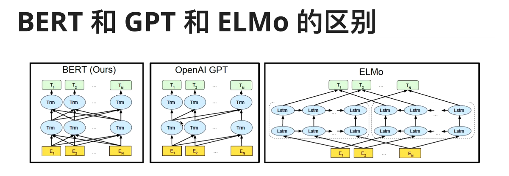

# 项目周报

    日期：2025-05-11

    项目实践题目：文本向量化的高级技术

## 实践内容
### COLBERT的检索优化
- BERT并不是专用于检索任务的模型，COLBERT的检索改进主要有两个方面：编码和交互。

- 如当我从文档（D）中检索 “2025年流行歌”（Q），BERT会将Q与D结合起来编码，也就是交叉编码，然后直接得到相似度分数。

- 而COLBERT将Q和D分别独立编码，得到$Q：\{q_1,q_2,...,qn\}$   $D:\{d1,d2,...,dn\}$  然后建立相似度矩阵，将每个q和d进行相似度计算，然后求和，得到最大的相似度。这样做的好处是降低每次查询的成本，BERT每次查询都要重新进行Q与D的交叉编码，且文档极大时很难处理。更别说COLBERT还会降维，这进一步提高了资源利用效率

- 而且COLBERT将D和Q进行单独编码后可以重复利用D的编码，后续只需要计算一次相似度。同时精确度也会更高。

### 深入了解BERT

#### BERT是对预训练方面技术的总结所得的产物。它的模型结构参考了ELMO，内部使用transformer，又利用W2V的CBOW方法，实现了利用“大规模无标记数据集”来训练模型。

 

- 我决定从小的方面开始叙述BERT。
#### 词向量
- 一开始的词向量只是神经网络语言模型的“副产物”，神经网络语言模型的主要任务是“预测下一个词”

- 在模型中有一步是：其独热编码（w）乘以一个经训练得到的最优矩阵（Q）再得到一个向量（c）， $wQ = c$,这个c就是一个词向量。

- 对于任何一个独热编码的词向量都可以通过 Q 矩阵得到新的词向量，可以转换维度，相似词之间的词向量之间也有了关系

- 而这时的Q是对于“预测下一个词”的最优，而不是“为了得到词向量”的最优。
#### W2V
- 因此Word2Vec这个主要任务是：“为了得到词向量”的模型出现了

- 它的目的就是训练最优的Q来得到词向量

- 但Word2Vec还有缺陷，它的词向量无法表示多义词。因为他的训练逻辑注定了一个词只会有一个词向量。
#### ELMO
- 而后ELMO通过双层双向LSTM，又在Q矩阵中塞入了更多的信息
  
- 如果说原来的W2V得到的词向量中只有单独的“苹果”意思
  
- 那么ELMO就可以通过：前文+词+后文=词'来得到词向量
  
- 如： apple-->我吃了一个苹果-->[1,20,10]
  
- apple-->我在用苹果手机-->[1,10,20]
  
-   也就是说ELMO的Q矩阵中掺入了上下文的联系,这也是BERT的上下文联系的参考由来。（但ELMO是伪双向）
#### TSM
- Transformer是注意力机制的堆叠。
  
- 它大体分为编码器和解码器两个模块（其核心我还不能很好解释，但其注意力和自注意力机制我已了解大半，只是编码器和解码器这一块有点滞涩）。
  
- BERT能够利用大规模的无标记文本的重点就在于tsm的利用
  
- 因为自注意力机制中，不需要一个主观的Q进行注意，而是文档中每个词都会与其他的词进行计算进而得到不同的权重
  
- 权重越高的词就越会被注意到，进而得到KeyWord。
  
#### BERT
- 结合上面的技术后，BERT这个集百家所长的结合产物因此诞生了。
  
- 回答BERT为什么在检索方面表现不优秀这个问题
- 其一是它确实不是用于检索的模型，它的结果并不精确；
- 其二它的自注意力机制占用的资源太多了，它的模型中有很多的tsm，tsm的编码器中又有小的编码器，同时不同的词还要进行一遍计算，这是一个很大的资源负担。

 ### 收获
- 理解了COLBERT的优化方向和原理。
- 从头认识了BERT，独热编码的使用，词向量的产生，W2V的出现和应用，对于W2V的缺陷优化的ELMO的原理和使用。然后是tsm和注意力机制，以及BERT的总结性利用先进技术。
- BERT的理解确实需要很多的前头知识，因为它并不像W2V的产生那样显得小而创新，而是对于一个时期的技术总结和运用。

 ### 要做的事
- 完整理解tsm的编码器和解码器

- 虽然知道ELMO，但还是不太明白LSTM的运行原理。

- 我学东西喜欢一层一层剥到最原始的东西，这个BERT追根溯源到了神经网络语言模型中，但还有一些分支线没踩明白，继续实现。

- 可以再学习DPR，ANCE的检索技术


```python

```


```python

```
